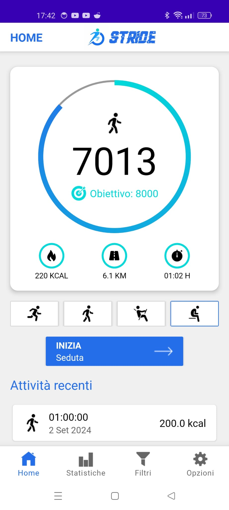
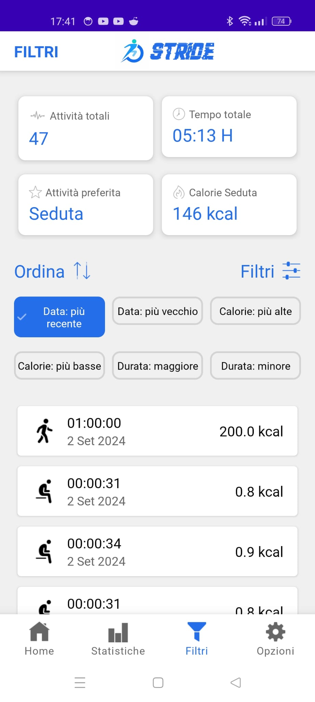
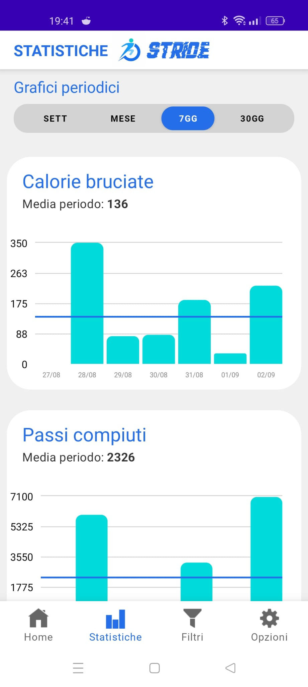
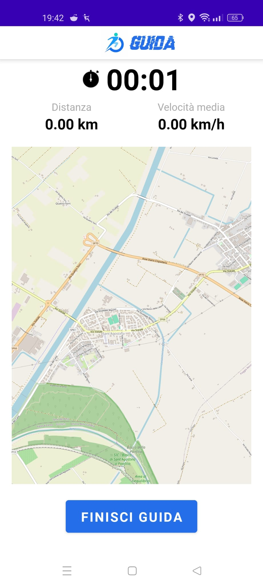
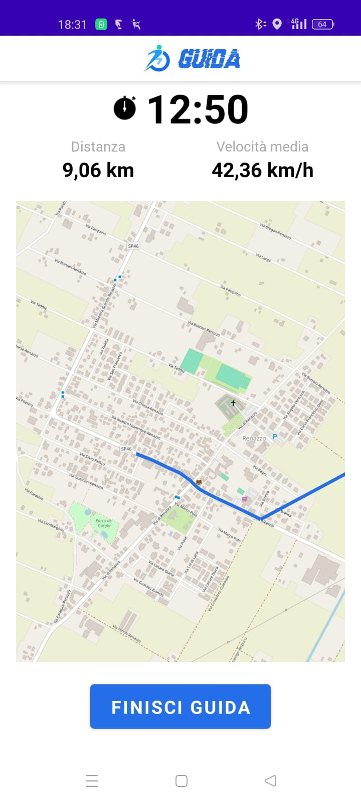
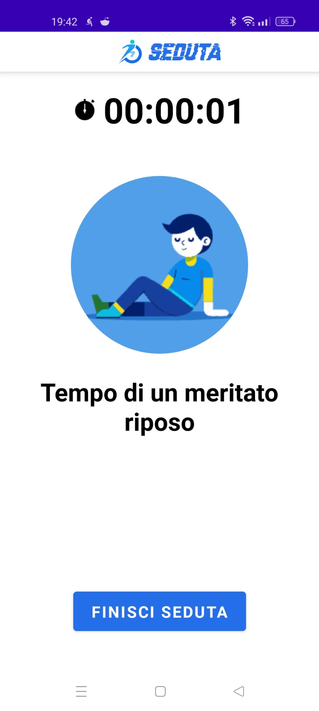
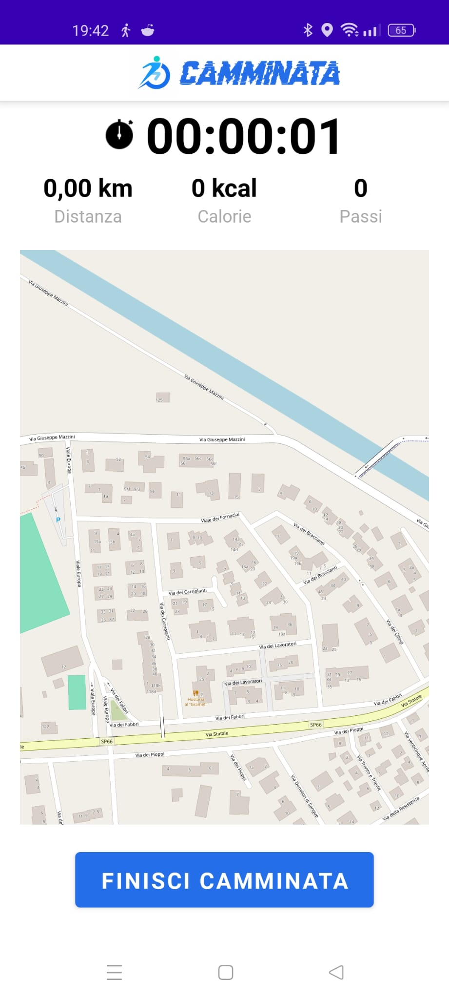
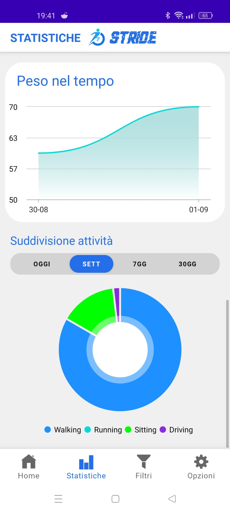
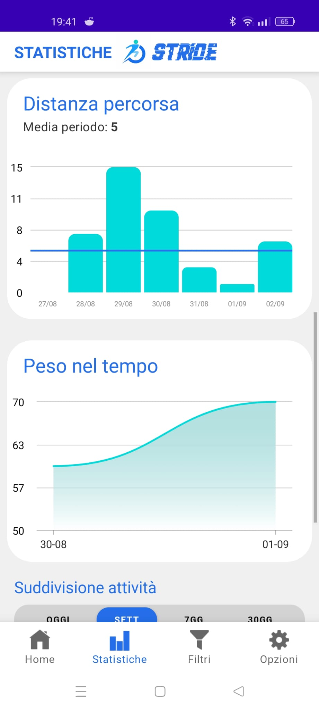

# Stride - Android Fitness Tracking App

Welcome to **Stride**, a comprehensive fitness tracking app designed for Android. Track your daily activities like walking, running, sitting, and driving, visualize them with detailed charts, and easily manage your data with powerful sorting and filtering options.

## Screenshots

Here are a few screenshots to give you a glimpse of Stride in action:

  
  
  
  

---

## Features

### Activity Tracking

Stride tracks four different types of physical activities:

- **Walking**
- **Running**
- **Sitting**
- **Driving**

You can record activities manually or let Stride automatically detect them in the background using Android’s **ACTIVITY_RECOGNITION_API**. This allows for seamless tracking without constant user intervention.

  
  
  

### Charts & Data Visualization

Stride provides a rich set of charts to visualize your activity data, helping you track progress and spot trends easily. You can view:

- **Bar Charts** for daily or weekly totals
- **Line Charts** to monitor weight trends over time
- **Pie Charts** for a breakdown of activities time

Charts are built using **Vico** and **MPAndroidChart** to ensure smooth performance and appealing visuals.

  
  

### Sorting and Filtering

Stride makes it easy to manage and analyze your activity data by providing robust **sorting and filtering** features. You can organize your activities based on:

- **Duration**
- **Calories burned**
- **Date of completion**

This allows for flexible analysis and makes it easy to focus on specific activity metrics.

  
  

### Local Storage with Room Database

All user data is stored locally using Android’s **Room Database**, ensuring fast, secure access to your fitness data. The app scales efficiently to handle thousands of activity records without performance loss.

---

## Tech Stack

- **Kotlin** - Core language for the app.
- **Room** - Local database for storing and retrieving fitness data.
- **MPAndroidChart & Vico** - Libraries for creating dynamic and interactive charts.
- **ACTIVITY_RECOGNITION_API** - Used to track physical activities in the background.

